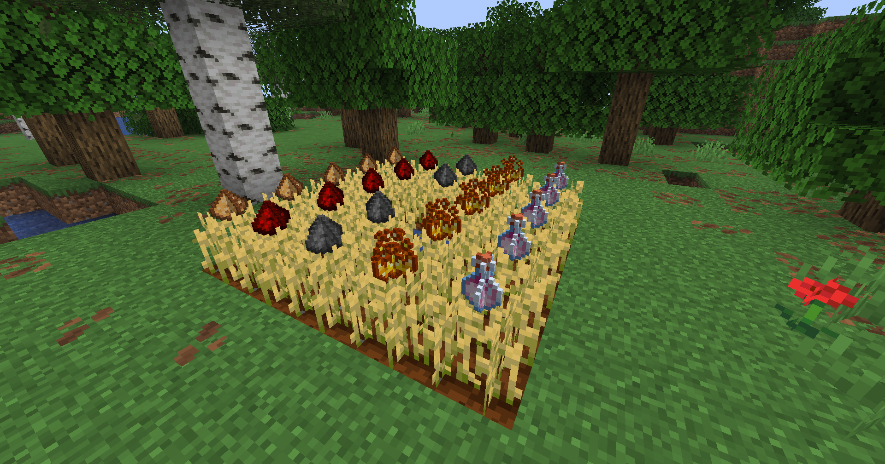

# TypicalAgronomy

> A farming expansion plugin inspired by Mystical Agriculture. Grow, harvest, and process hundreds of materials through a tiered seed and essence system.

Tested on: **Paper 1.21** | Requires **Java 21+**

---

## Features

### Custom Crop System
- Plant custom seeds on farmland — each seed grows like wheat and can be harvested when fully mature
- A floating **item display** rises above the crop as it grows, showing the crop's material
- **Right-click with a hoe** to harvest a mature crop without breaking it — the crop resets to age 0 and stays planted
- Hoes consume durability on use (Unbreaking is respected)
- Farmland is protected from trampling while a custom crop is planted on it
- Crop and display state are saved to `crops.yml` and restored on server restart

### Material Crops (89 crops)
Data-driven crops covering common materials across all 5 tiers — ores, logs, mob drops, nether materials, end materials, and rare items. Each crop produces:
- 1× its Seed (to replant)
- 1× its Essence (colored dye item)

Essences can be reconstituted: **9× Essence → 1× original material** (crafted at the Agronomy Station).

Seeds are crafted at the Agronomy Station using the original material, the tier's Essence, and the tier's Seed.

### Agronomy Station
A custom 3×3 crafting block crafted from **1 Crafting Table + 1 Wheat Seeds** (shapeless, vanilla crafting table).
Supports shaped and shapeless recipes. Right-click to open; includes a built-in **Recipe Browser**.

### Recipe Browser
Browse all Agronomy Station recipes by category, with pagination. Click any recipe to view its ingredients in a mock crafting grid.

---

## Commands

| Command | Description |
|---------|-------------|
| `/typicalagronomy items` | Open the item browser |
| `/typicalagronomy reload` | Reload config and lang.yml |

Alias: `/tyagr`

---

## Coming Soon
- Machines
- Additional crafting stations

---

## Requirements
- Paper 1.21+
- Java 21+
